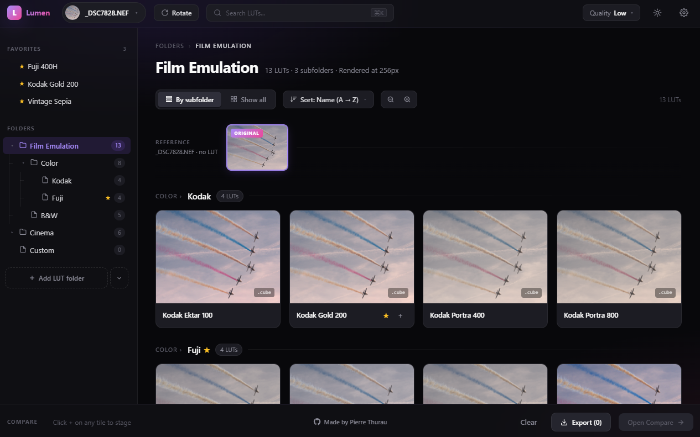
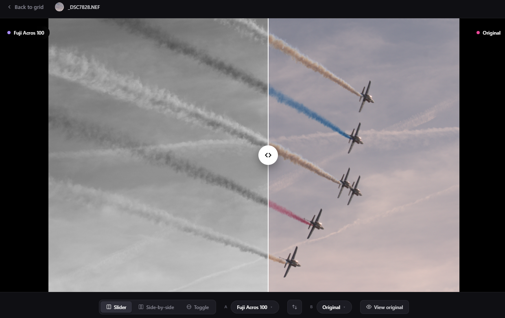
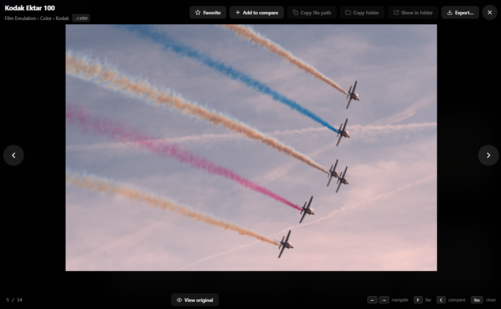

# Lumen

### Find the perfect LUT in seconds, not hours.

Real-time **LUT preview** studio for photographers and colorists.
Drag in a folder of `.cube` files, point Lumen at your RAW or JPEG,
and watch every look render in a single scrollable grid, for real,
on the GPU.

&nbsp;&nbsp;

&nbsp;

&nbsp;

---

## 🎨 Why Lumen?

Color graders waste **hours** auditioning LUTs one at a time. Every other
tool either lies to you or makes you wait.

- **Lightroom-style preview panels** use CSS filters that fake the look. What you see isn't what you get.
- **DaVinci, Premiere & friends** force you to load each LUT one at a time.
- **Online LUT viewers** can't even open your RAW.

Lumen does the obvious thing nobody else does: **renders every LUT in
your folder on your actual photo, in parallel, on the GPU.** Click
through 700 looks in under a minute and *know* which one is right.

---

## 📸 See it in action

*The main grid: every `.cube` in your folder rendered on your actual photo, in parallel, on the GPU.*

 

*Compare any two LUTs side-by-side. Drag the slider, toggle, or hold a key to peek at the original.*

 

*Fullscreen on any tile to inspect details at full resolution.*

---

## ✨ Highlights

| | |
|---|---|
| **🎨 Real previews, never fakes** | Every tile is your photo with the actual LUT applied via trilinear interpolation in a GPU compute shader. Not CSS filters. Not approximations. Pixel-perfect. |
| **⚡ Fast at any scale** | A 700-LUT pack renders in under a minute on mid-range hardware. Rotation? Doesn't re-render: survives via in-memory canonical-RGBA cache. Switching quality cancels stale renders mid-flight. |
| **📷 RAW out of the box** | `.NEF` (Nikon), `.CR2` / `.CR3` (Canon), `.ARW` (Sony), `.RAF` (Fuji), `.RW2`, `.ORF`, `.SRW`, `.DNG`. Decoded natively. |
| **🔀 Compare side-by-side** | Slider, side-by-side split, or "hold to peek at original". Stage as many LUTs as you want via the compare tray. |
| **📦 Batch JPEG export** | Stage the LUTs you like, click Export, get a folder of `<photo>_<lut>.jpg` files. |
| **💾 Smart caching** | Disk-backed LRU + in-memory canonical cache. Re-opening the same photo + LUT pair = instant. |
| **🌍 Localised** | English + French shipped. Adding a language is a one-PR change. |
| **🌙 Dark + light themes** | Auto-detect or toggle with `T`. |
| **🔄 Auto-update** | Signed releases. Your installed copy checks for new versions daily and prompts to install. |
| **🎁 CC0 sample LUTs included** | Six bundled looks so you can try Lumen before downloading a LUT pack. |

---

## 📥 Install

**Windows 10 / 11 (x64)**. Single installer, ~6 MB:

### [⬇ Download the latest Windows installer](https://github.com/pierre-thurau/lut-vizualizer/releases/latest)

On first launch Windows SmartScreen may flash **"Windows protected your
PC"** because the installer isn't yet code-signed (free / personal
project). Click **More info → Run anyway**.

> macOS and Linux builds coming. ⭐ [Star the repo](https://github.com/pierre-thurau/lut-vizualizer/stargazers) to get notified when they ship.

---

## 🚀 Quick start

1. **Open Lumen** from the Start menu
2. **Drag a folder** of `.cube` / `.lut` / `.3dl` files anywhere on the window (or click *Add LUT folder*)
3. **Open a photo**: drag a RAW/JPEG in, or use the toolbar
4. **Click any tile** to compare it side-by-side with the original
5. Press **F** to favourite a look, **C** to stage it in the compare tray, **?** for the full shortcut sheet

Don't have a LUT pack handy? Click **Try sample LUTs** on the welcome screen. Lumen ships with six CC0-licensed looks (sepia, teal & orange, B&W punch, warm vintage, cool blue, identity).

---

## ☕ Like Lumen? Keep it caffeinated

Lumen is free and ad-free. If it saved you an hour of pixel-peeping
this week, consider sending a coffee my way. No subscription, no
account, just a one-tap thank-you that funds the next feature.

### [💚 Tip the author on Revolut](https://revolut.me/pierrethurau)

Either way, **starring the repo costs nothing** and helps other
photographers find Lumen.

---

## 🛠️ Under the hood

| Layer | Tech |
|---|---|
| **App shell** | [Tauri 2](https://tauri.app) (Rust core, WebView frontend) |
| **UI** | [Svelte 5](https://svelte.dev) (runes-based reactive store) + TypeScript |
| **GPU renderer** | [wgpu](https://wgpu.rs) compute shader with trilinear sampler |
| **CPU fallback** | [rayon](https://github.com/rayon-rs/rayon) data-parallel applier, row-stripe cancellable |
| **JPEG encoder** | [mozjpeg](https://github.com/mozilla/mozjpeg) (smaller files, faster encode than the `image` crate default) |
| **RAW decoder** | [rawloader](https://github.com/pedrocr/rawloader) + [imagepipe](https://github.com/pedrocr/imagepipe) |
| **Updater** | minisign-signed manifests fetched from this repo's Releases |

The Rust workspace lives in three crates:
- `lut_core`: parsing, 3D LUT data structure, CPU + GPU applier, cache, scan, RAW decode
- `lut_app`: Tauri command surface + app state
- `lut_cli`: standalone CLI for applying one LUT to one photo (testing / scripting)

---

## ⚖️ License

Dual-licensed under either **MIT** or **Apache-2.0** at your option.

Author preference: **personal & creative use, not for commercial
redistribution.** The bundled CC0 sample LUTs are public domain. Use
those however you like.

---

## 🙌 Credits

Created by **Pierre Thurau**.

Standing on the shoulders of giants: [Tauri](https://tauri.app),
[Svelte](https://svelte.dev), [Rust](https://www.rust-lang.org),
[wgpu](https://wgpu.rs), [image-rs](https://github.com/image-rs/image),
[rawloader](https://github.com/pedrocr/rawloader), and
[mozjpeg](https://github.com/mozilla/mozjpeg).

---

**[Download](https://github.com/pierre-thurau/lut-vizualizer/releases/latest)** &nbsp;·&nbsp;
**[Tip the author](https://revolut.me/pierrethurau)** &nbsp;·&nbsp;
**[Report an issue](https://github.com/pierre-thurau/lut-vizualizer/issues)** &nbsp;·&nbsp;
**[Latest version](https://github.com/pierre-thurau/lut-vizualizer/releases)**

Keywords: LUT preview, LUT viewer, .cube file, 3D LUT, color grading, film emulation, RAW photo, photography color correction, Windows, free, open source.

